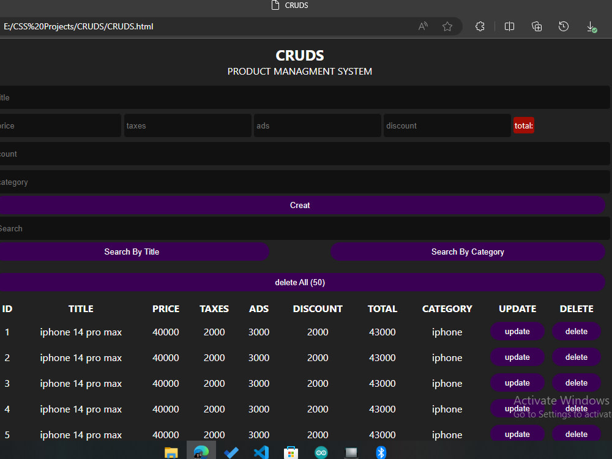

# CRUD-project
<h5>https://osm-product-managment-system.netlify.app</h5>

CRUD Project Using HTML CSS And JavaScript

<ul>
<li>C ==> Ceate</li>
<li>R ==> Read</li>
<li>U ==> Udapte</li>
<li>D ==> Delete</li>
</ul>

